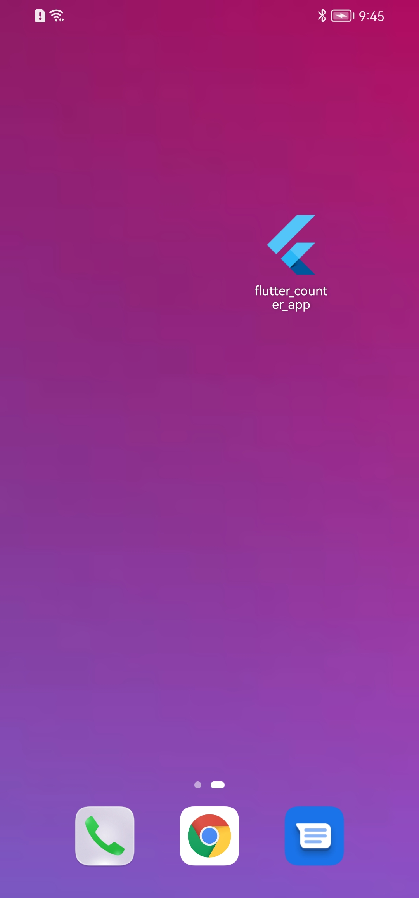
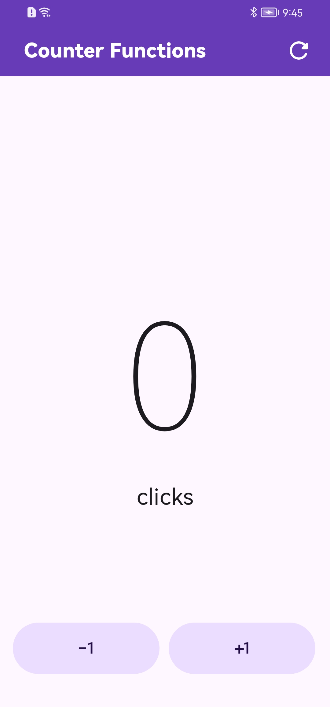

# Flutter Counter App

This is my first Flutter mobile application. It is a simple counter app where you can increment and decrement a counter. It showcases the use of basic Flutter widgets, including `AppBar`, `FloatingActionButton`, and custom components.

## Features

- Display a counter value that can be incremented or decremented.
- A reset button in the `AppBar` to reset the counter to zero.
- Custom `FloatingActionButton` widgets to interact with the counter.

## Screenshots

<div style="display: flex; justify-content: center;">
  
  
  
  
</div>

## Project Structure

The project follows a simple structure to keep the code organized, especially as a beginner in Flutter.

```
lib/
├── presentation/
│   ├── screens/
│   │   └── counter/
│   │       └── counter_functions_screen.dart
│   └── widgets/
│       └── custom_button.dart
└── main.dart
```

### Folder Breakdown

- **lib/main.dart**: The entry point of the app where the `MyApp` widget is initialized and `CounterFunctionsScreen` is called.

- **presentation/screens/counter**: Contains the main screen of the app (`counter_functions_screen.dart`) where the counter logic is implemented.

- **presentation/widgets**: Contains reusable widgets. For now, it holds the `CustomButton` widget used in the floating action buttons.

## Author

### Alextina

[](https://www.alextina.pe)
[](mailto:castilloavilaa@gmail.com)
[](https://www.linkedin.com/in/alextina/)
